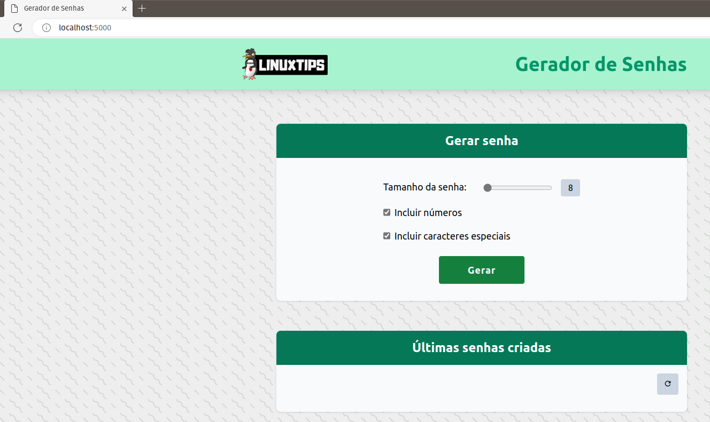

### Helm
Helm é uma ferramenta de empacotamento de software livre que ajuda a instalar e gerenciar o ciclo de vida de aplicativos Kubernetes. Semelhante a gerenciadores de pacotes do Linux, como APT e Yum, o Helm é usado para gerenciar charts Kubernetes, que são pacotes de recursos de Kubernetes pré-configurados.

## Projeto
O projeto chamado Giropops-Senhas é um gerador de senhas baseado em Python, que armazena o histórico das senhas geradas via cache em um banco de dados Redis.

# Adicionando o repositorio externo

```
helm repo add meu-giropops-senhas **https://jhonthan.github.io/Descomplicando_Helm/**
```

Listar os repositorios:

```
helm repo list
```

Adicionando o Helm baseado no repositorio externo

```
helm install giropops-senhas meu-giropops-senhas/giropops-senhas
```

Mostrar informacoes do Helm Chart:
```
helm show all meu-giropops-senhas/giropops-senhas
```

# Acessar os recursos instalados no K8S

Verificar os pods criados via Deployment do Chart
```
kubectl get pods
```

Verificar os servicos criados via Chart
```
kubectl get services
```

Port-Forward para acessar o POD
```
kubectl port-forward svc/giropops-senhas-app 5000:5000
```

Abrir o navegador 'localhost:5000'



# Baseado no projeto Giropops-Senhas
```
https://github.com/badtuxx/giropops-senhas-labs
```